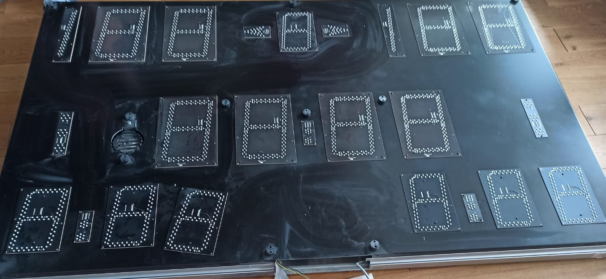
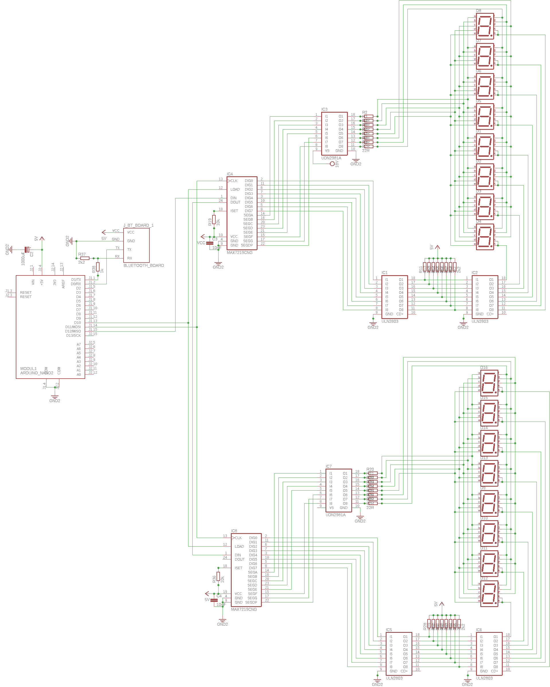

# LEDSpielAnzeige
## Controller für LED Spieleanzeige (geklaut)
 
 
 ### Display
 * 2 x 8 7-Segment Anzeigen
 * Jedes Segment 7 LEDs in Reihe (Vfor=1.9V)
 * Mittlere Segmente 8 LEDs in Reihe
 * Alle Anoden (+) gleicher Segmente sind verbunden (alle SegA,...) (Daten)
 * LEDs einer 7-Segment Anzeige haben gemeinsame Kathode (-) (Adresse)
 * DecimalPoint Anschlüsse für ":",">","|",...
 
 ### Anschlüsse
 * 2x 16 Pin Kabelanschluss
 * 8 Pin Adresse (jeweils 1Bit auf "1")
 * 8 Pin Daten (7-Segmente)
 * Adressen werden gemultiplext
 
 ### Schaltplan
 
 
 #### Bauteile
 * [Arduino Nano](https://store.arduino.cc/arduino-nano)
 * [MAX7219](https://datasheets.maximintegrated.com/en/ds/MAX7219-MAX7221.pdf)
 * [UDN 2981 Source Driver](https://www.horter.de/doku/UDN2981.pdf)
 * [ULN2803 NPN Darlington Arrays](http://www.ti.com/lit/ds/symlink/uln2803a.pdf?ts=1591118146402)
 
 ### Links
 * [MAX7219 and higher voltage LED displays](https://forum.arduino.cc/index.php?topic=54798.0)
 * [MAX7219 mit UDN 2981 und ULN2803](https://forum.arduino.cc/index.php?action=dlattach;topic=54798.0;attach=1457)