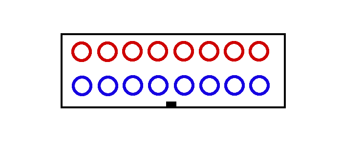

# LEDSpielAnzeige
## Controller für LED Spieleanzeige (geklaut)
 
 
 ### Display
 * 2 x 8 7-Segment Anzeigen
 * Jedes Segment 7 LEDs in Reihe (Vfor=1.9V)
 * Mittlere Segmente 8 LEDs in Reihe
 * Alle Anoden (+) gleicher Segmente sind verbunden (alle SegA,...) (Daten)
 * LEDs einer 7-Segment Anzeige haben gemeinsame Kathode (-) (Adresse)
 * DecimalPoint Anschlüsse für ":",">","|",...
 
 ### Anschlüsse
  
 * 2x 16 Pin Kabelanschluss
 * 8 Pin Adresse (jeweils 1Bit auf "1")
 * 8 Pin Daten (7-Segmente)
 * Adressen werden gemultiplext
 
 ### Schaltplan
 
 
 #### Bauteile
  * [LM2596 Step-Down DC Buck Converter](https://www.reichelt.de/schaltregler-step-down-adj-3a-4-75-40vi-to220-5-lm2596tvadj-p255435.html?&trstct=pos_7&nbc=1)
  * [IC Sockel](https://www.reichelt.de/ic-sockel-16-polig-doppelter-federkontakt-gs-16-p8208.html?&nbc=1)
  * [Lochrasterplatine 16x10cm](https://www.reichelt.de/lochrasterplatine-hartpapier-160x100mm-h25pr160-p8272.html?&nbc=1)
  * [Arduino Nano](https://www.reichelt.de/arduino-kompatibles-nano-board-atmega328-mini-usb-ard-nano-v3-p225690.html?&trstct=pos_1&nbc=1)
  * [Netzteil 18/24V?](https://www.reichelt.de/steckernetzteil-25-w-24-v-1-04-a-mw-gst25e24-p171101.html?&nbc=1)
##### Treiber
 * [MAX7219 Common Cathode Driver](https://www.reichelt.com/de/de/display-treiber-konstantstromregler-dil-24-max-7219-cng-p11260.html?&trstct=pos_1&nbc=1)
 * [UDN 2981(=_TD62783AP_)  Source Driver](https://www.reichelt.de/leistungstreiber-8-kanal-dil-18-udn-2981-p22008.html?&trstct=pos_0&nbc=1)
 * [ULN2803 NPN Darlington Arrays](https://www.reichelt.de/eight-darlington-arrays-dil-18-uln-2803a-p22085.html?&trstct=pos_0&nbc=1)
 * [74HC595 Shift Register](https://www.reichelt.de/shift-register-3-state-ausgang-2-6-v-dil-16-74hc-595-p3269.html?&trstct=pos_0&nbc=1)
 * [74HCT240 Inverter](https://www.reichelt.com/de/de/inverter-octal-4-5-5-5-v-dil-20-74hct-240-p3351.html?&trstct=pos_1&nbc=1)
 * [TPIC6B595N High Power Shift Register](https://www.reichelt.de/powerlogik-8-bit-schiebe-register-dil-20-tpic-6b595-n-p147328.html?PROVID=2788&gclid=EAIaIQobChMIiOX3hf_q6QIVBrDtCh31ww5PEAYYAyABEgIuufD_BwE&&r=1)
 
 
 ### Links
 * [MAX7219 and higher voltage LED displays](https://forum.arduino.cc/index.php?topic=54798.0)
 * [MAX7219 mit UDN 2981 und ULN2803](https://forum.arduino.cc/index.php?action=dlattach;topic=54798.0;attach=1457)
