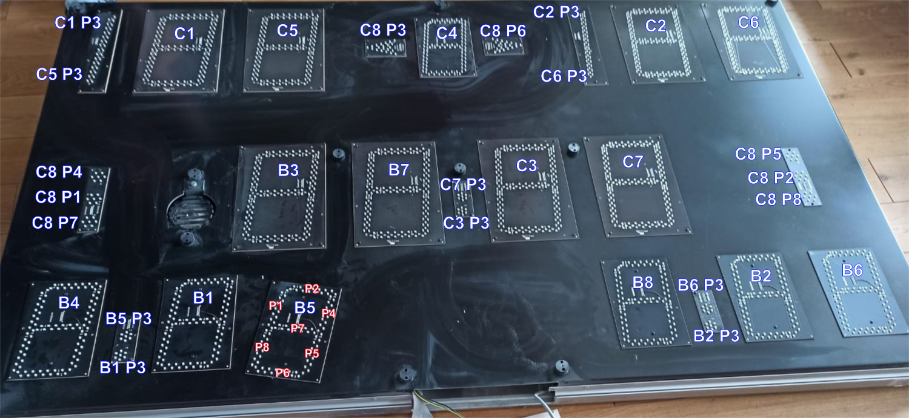
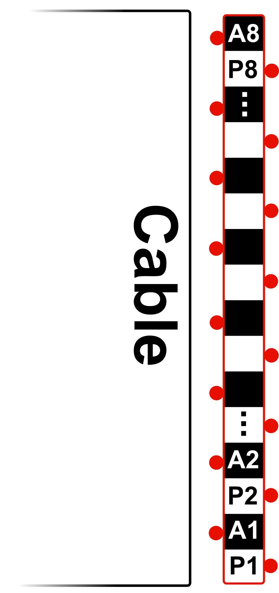
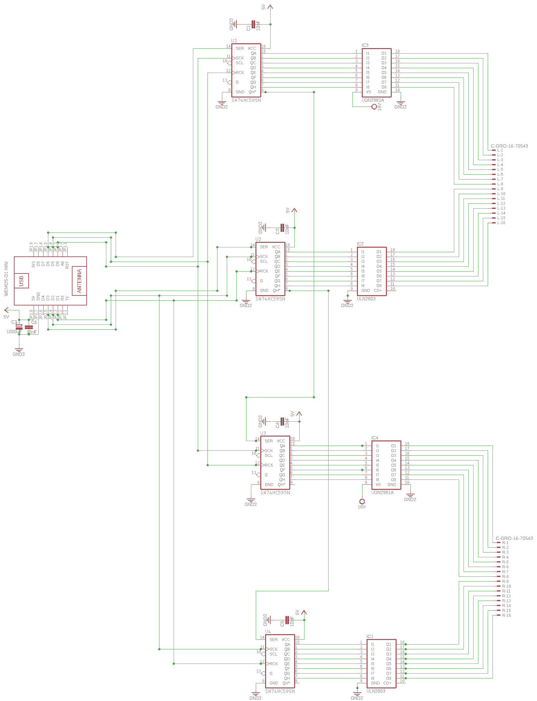

# LEDSpielAnzeige - Controller für LED Spielanzeige
 
 
 ### Display
 * 2 x 8 7-Segment Anzeigen
 * Jedes Segment 7 LEDs in Reihe (Vfor=1.9V)
 * Mittlere Segmente 8 LEDs in Reihe
 * Alle Anoden (+) gleicher Segmente sind verbunden (alle SegA,...) (Daten)
 * LEDs einer 7-Segment Anzeige haben gemeinsame Kathode (-) (Adresse)
 * DecimalPoint Anschlüsse für ":",">","|",...
 
 ### Anschlüsse
  
 * 2x 16 Pin Kabelanschlüsse
 * 8 Pin Adresse (jeweils 1Bit auf "1")
 * 8 Pin Daten (7-Segmente)
 * Adressen werden gemultiplext
 
 ### Schaltplan
 
 ---
 #### Bauteile
  * [LM2596 Step-Down DC Buck Converter](https://www.reichelt.de/schaltregler-step-down-adj-3a-4-75-40vi-to220-5-lm2596tvadj-p255435.html?&trstct=pos_7&nbc=1)
  * [IC Sockel 14/16pin](https://www.reichelt.de/ic-sockel-16-polig-doppelter-federkontakt-gs-16-p8208.html?&nbc=1)
  * [Lochrasterplatine 16x10cm](https://www.reichelt.de/lochrasterplatine-hartpapier-160x100mm-h25pr160-p8272.html?&nbc=1)
  * [WeMos D1 mini](https://www.ebay.de/itm/D1Mini-ESP8266-Modul-Mikrokontroller-Board-WLAN-Wifi-Nodemcu-Wemos-Arduino/164007576934?ssPageName=STRK%3AMEBIDX%3AIT&_trksid=p2057872.m2749.l2649)
  * [Netzteil 24V](https://www.reichelt.de/steckernetzteil-25-w-24-v-1-04-a-mw-gst25e24-p171101.html?&nbc=1)
#### Treiber
 * [UDN 2981(=_TD62783AP_)  Source Driver](https://www.reichelt.de/leistungstreiber-8-kanal-dil-18-udn-2981-p22008.html?&trstct=pos_0&nbc=1)
 * [ULN2803 NPN Darlington Arrays](https://www.reichelt.de/eight-darlington-arrays-dil-18-uln-2803a-p22085.html?&trstct=pos_0&nbc=1)
 * [74HC595 Shift Register](https://www.reichelt.de/shift-register-3-state-ausgang-2-6-v-dil-16-74hc-595-p3269.html?&trstct=pos_0&nbc=1)
 ---
 
 # Code
 
 ### Wemos Arduino Sketch
 * **Multiplexing** both Addressbusses (**Common Cathodes**) (_ULN2803s_ "B1-B8"+"C1-C8") with 1x _74HC595_ ("U2") output
 * Loading **7-Segment Data** (**Anodes**) for every Display concurrent to multiplexing with 2x _74HC595_ ("U1"+"U3")
 * Switch modes on **WiFi** commands
 
 ### React Web App
 * **WebServer** for User Interface
 * Sending Commands over WiFi
 * [ESP8266-React Framework](https://github.com/rjwats/esp8266-react)
 ---
 ### Links
 * [ULN2803 Function](https://www.conrad.de/de/ratgeber/handwerk-industrie-wiki/elektronik-bauteile/uln2803.html#anschluss)
 * [Arduino Forum Thread](https://forum.arduino.cc/index.php?topic=688158.0)
