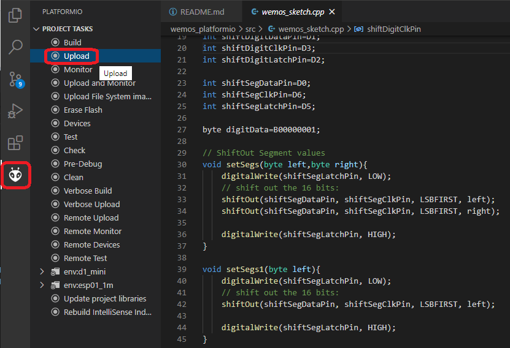

# Wemos_react_platformio

 ### Configure Wifi Settings
 1. Make sure in [/factory_settings](./factory_settings.ini) WiFi Acces Point is enabled:
`-D FACTORY_AP_PROVISION_MODE=AP_MODE_ALWAYS`
 2. [Build & Upload](#building--uploading) the Project
 3. Connect to ESP8266 React WiFi network
 4. Set WiFi Settings for local WiFi connection
 5. Preferably set a Static IP for Local Development (see [.env.development](./interface/.env.development) )

 
### Building & Uploading

Default Environment: d1_mini (see [platformio.ini](./platformio.ini))

## Libraries Used

* [React](https://reactjs.org/)
* [Material-UI](https://material-ui.com/)
* [notistack](https://github.com/iamhosseindhv/notistack)
* [ArduinoJson](https://github.com/bblanchon/ArduinoJson)
* [ESPAsyncWebServer](https://github.com/me-no-dev/ESPAsyncWebServer)
* [AsyncMqttClient](https://github.com/marvinroger/async-mqtt-client)
